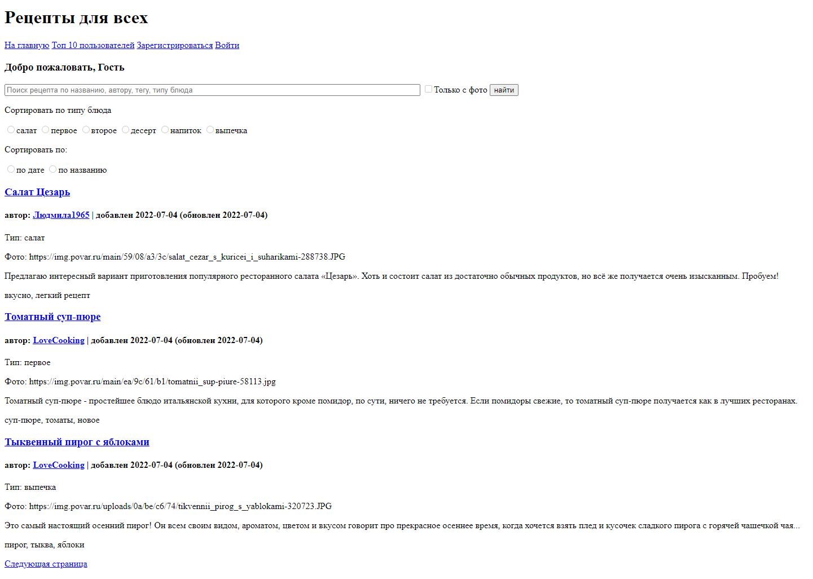

Recipes_web
===========
**Recipes_web** - это сервис, позволяющий пользователям авторизовываться и добавлять рецепты блюд, а затем просматривать сделанные записи, фильтруя последние по части названия, автору, типу блюда и тегам, а также сортируя их по дате добавления
и названию. Результат запроса выдается постранично. На отдельной странице можно просматривать топ-10 пользователей по количеству добавленных ими рецептов. Администратор может блокировать как отдельные рецепты, исключая их из результатов поиска, так и самих пользователей, ограничивая им доступ к функционалу сайта.

Технологии:
===========

+ aiohttp (асинхронный фреймворк для создания приложения)
+ aiohttp-jinja2 (отрисовка html-шаблонов)
+ aiohttp_session (пользовательские сессии)
+ SQLAlchemy(ORM для работы с БД)
+ bcrypt (для шифрования пользовательских паролей)
+ PyYAML (для реализации файла конфигурации). 

**Версия Python: 3.9**

**База данных: PostgreSQL 14.4**

Конфигурация сервера перед запуском:
===========

1. Устанавливаем необходимые библиотеки из файла requirements.txt:
```commandline
$ pip install -r requirements.txt
```
2. В корневой папке проекта (на уровне с main.py) создаем и заполняем файл config.yaml:
```python
common:
  host: 127.0.0.1  #  хост сервера
  port: 8080  #  порт сервера
postgres:  #  Подставляем данные пользователя СУБД, её хост и название используемой БД
  database_url: postgresql+psycopg2://db_username:db_user_password@db_host/db_name
admin:  #  создаем токен для входа в режим администирования проекта (набор любых символов)
  token: bndt43tjfwoeihr34rfreo34jfkaskljw2dwoifj
```
3. Запускаем проект:
```commandline
$ python main.py  
```
Готово! Сервер запущен!

Для доступа к режиму администрирования перейдите по адресу /admin и введите токен, указанный в config.yaml.

Будущие обновления
===========

1. Для большей защищенности данных CookieStorage, хранящий данные о пользовательской сессии, будет заменен на RedisStorage (библиотека aioredis).
2. Для улучшения показателей быстродействия сервиса предполагается внедрение функционала асинхронного SQLAlchemy.

Скриншоты
===========
Домашняя страница с поисковой строкой

